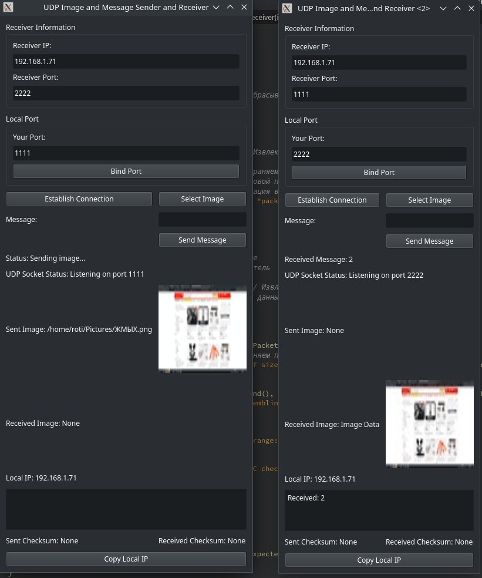
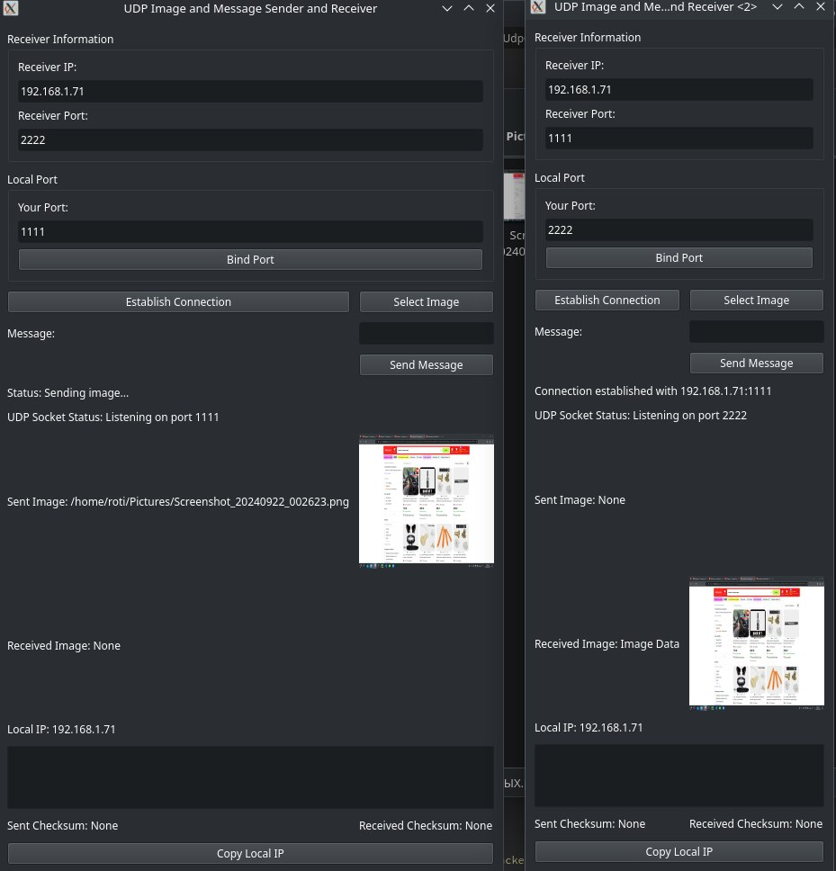

# README.md

## Проект: UDP Sender/Receiver для Изображений и Сообщений

### Авторы
- **Авдеев Д.И.**
- **Митюшина Е.В.**

Группа М8О-205М-23

### Описание
Данный проект представляет собой приложение для отправки и получения изображений и текстовых сообщений через UDP-соединение. Используя библиотеку **Qt**, приложение предоставляет графический интерфейс для взаимодействия с пользователем, а также использует библиотеку **Crypto++** для шифрования данных. Приложение поддерживает отправку изображений в формате JPEG и текстовых сообщений, обеспечивая при этом безопасность передаваемых данных.

### Основные функции
- **Отправка изображений**: Возможность выбора и отправки изображений в формате JPEG.
- **Отправка текстовых сообщений**: Пользователи могут отправлять текстовые сообщения, которые шифруются перед отправкой.
- **Получение изображений и сообщений**: Автоматическая обработка входящих данных и отображение полученных изображений и текстовых сообщений.
- **Шифрование данных**: Использование алгоритмов шифрования AES и RSA для защиты данных.

### Установка

1. **Системные требования**:
   - Операционная система: Windows, macOS или Linux.
   - Qt: Версия 5 или выше.
   - C++: Поддержка C++17.
   - Crypto++: Библиотека для шифрования.

2. **Установка зависимостей**:
   Убедитесь, что у вас установлены необходимые библиотеки. Для установки Crypto++ на Ubuntu используйте следующую команду:
   ```bash
   sudo apt install libcrypto++-dev

### Использование

1. Задаём порт, на котором будем слушать приходящие сообщения на запущенном приложении (через Bind port)
2. На другом приложении делаем идентичные манипуляции с портом
3. Задаём в Receiver Information IP-адрес и порт куда отсылаем информацию
4. Выбираем сокет на котором будем работать (самописный или реализованный по средством Qt) 
5. Для второго приложения заполняем аналогичные поля
6. Нажимаем Establish Connection на обоих приложениях для обмена RSA ключами через канал, защищённый RSA-шифрованием
7. После успешного соединения, можем отправить текствое сообщение или изображение (при отправки и получении текса или изображения они шифруется и дешифруется по средством симметричного шифрования)
8. Исходящий текст вводится в поле Message и при нажатии на Send Message отправляется на принимающие прилоджение. Входящий текст отображается в блоке вывода текста
9. Для отправки изображение нужно нажать на Select Image и выбрать интересующую картинку. Исходящие изображение отображается в блоке Sent Image . После получения изображения, оно собираетсмя попиксельно и отображается в блоке Received Image

### Пример работы приложения 




### Примечания 

1. При отправке изображение делится на пакеты размером 2048 бит 
2. Для каждого пакета вычесляется контрольная сумма и добавляется в конец отправляемого сообщения. Она проверяется при получении пакета, и в случае успеха контрольная сумма отбрасывается, и готовое сообщение добавляется в байтовый массив для дальнейшей переконвертации из JPEG и последующей сборки в изображение
3. Количество ожидаемых и пришедших пакетов отображается в окне терминале 
4. Все сообщения, как текстовые так и изображения, шифруются перед отправкой по средством симметричного шифрования
5. Для более удобного копирования своего IP-адреса имеется кнопка Copy Local IP, которая записывает в буфер обмена наш IP-адрес
 

# Описание классов проекта UDP Sender/Receiver для Изображений и Сообщений

В этом разделе мы подробно рассмотрим каждый класс проекта, его назначение и основные методы. Проект состоит из нескольких классов, каждый из которых выполняет свою уникальную функцию в рамках системы отправки и получения изображений и сообщений.

## 1. CryptoUtils

### Описание
Класс `CryptoUtils` отвечает за шифрование и дешифрование данных с использованием алгоритмов AES и RSA. Он предоставляет методы для генерации ключей и обработки текстовой информации.

### Основные методы
- **GenerateRSAKeys**: 
  - **Описание**: Генерирует пару RSA ключей (публичный и приватный).
  - **Параметры**: 
    - `publicKey`: Строка для хранения публичного ключа.
    - `privateKey`: Строка для хранения приватного ключа.

- **AESEncrypt**:
  - **Описание**: Шифрует текст с использованием алгоритма AES.
  - **Параметры**:
    - `plainText`: Исходный текст.
    - `key`: Ключ для шифрования.
  - **Возвращает**: Зашифрованный текст.

- **AESDecrypt**:
  - **Описание**: Дешифрует текст, зашифрованный с использованием алгоритма AES.
  - **Параметры**:
    - `cipherText`: Зашифрованный текст.
    - `key`: Ключ для дешифрования.
  - **Возвращает**: Исходный текст.

- **RSAEncrypt**:
  - **Описание**: Шифрует текст с использованием публичного RSA ключа.
  - **Параметры**:
    - `plainText`: Исходный текст.
    - `publicKey`: Публичный ключ.
  - **Возвращает**: Зашифрованный текст.

- **RSADecrypt**:
  - **Описание**: Дешифрует текст, зашифрованный с использованием приватного RSA ключа.
  - **Параметры**:
    - `cipherText`: Зашифрованный текст.
    - `privateKey`: Приватный ключ.
  - **Возвращает**: Исходный текст.

---

## 2. ImageReceiver

### Описание
Класс `ImageReceiver` отвечает за прием изображений и текстовых сообщений через UDP-соединение. Он обрабатывает входящие данные и отображает полученные изображения и сообщения.

### Основные методы
- **initialize**:
  - **Описание**: Инициализирует UDP-соединение на указанном хосте и порту.
  - **Параметры**:
    - `host`: IP-адрес получателя.
    - `port`: Порт для приема данных.
  - **Возвращает**: `true`, если инициализация успешна, иначе `false`.

- **onDataReceived**:
  - **Описание**: Обрабатывает входящие данные, определяя их тип (изображение, текст или ключ).
  - **Параметры**:
    - `data`: Полученные данные в формате `QByteArray`.

- **assembleImage**:
  - **Описание**: Составляет изображение из полученных пакетов и отображает его.
  - **Возвращает**: `void`.

- **verifyCRC**:
  - **Описание**: Проверяет контрольную сумму для целостности данных.
  - **Параметры**:
    - `data`: Данные для проверки.
  - **Возвращает**: `true`, если контрольная сумма совпадает, иначе `false`.

- **handleTextMessage**:
  - **Описание**: Обрабатывает текстовые сообщения, дешифруя их и испуская сигнал о получении.
  - **Параметры**:
    - `data`: Данные текстового сообщения.

- **handleKeyMessage**:
  - **Описание**: Обрабатывает сообщения с ключами, испуская сигнал с полученным ключом.
  - **Параметры**:
    - `data`: Данные с ключом.

---

## 3. ImageSender

### Описание
Класс `ImageSender` отвечает за отправку изображений и текстовых сообщений через UDP-соединение. Он шифрует данные перед отправкой и разбивает изображения на пакеты.

### Основные методы
- **sendImage**:
  - **Описание**: Отправляет изображение, сжимая его в формат JPEG и разбивая на пакеты.
  - **Параметры**:
    - `image`: Изображение в формате `QImage`.
  - **Возвращает**: `void`.

- **sendTextMessage**:
  - **Описание**: Отправляет текстовое сообщение, предварительно шифруя его.
  - **Параметры**:
    - `message`: Сообщение в формате `QString`.
  - **Возвращает**: `void`.

- **sendKey**:
  - **Описание**: Отправляет публичный ключ.
  - **Параметры**:
    - `key`: Публичный ключ в формате `std::string`.
  - **Возвращает**: `void`.

---

## 4. ImageTransfer

### Описание
Класс `ImageTransfer` отвечает за обработку изображений и разбиение на пакеты.

### Основные методы

- **splitIntoPackets**:
  - **Описание**: Разбивает данные на пакеты заданного размера.
  - **Параметры**:
    - `data`: Данные для разбиения.
  - **Возвращает**: Вектор пакетов в формате `QVector<QByteArray>`.

- **calculateCRC**:
  - **Описание**: Вычисляет контрольную сумму для данных.
  - **Параметры**:
    - `data`: Данные для вычисления контрольной суммы.
  - **Возвращает**: Контрольная сумма в формате `QByteArray`.

---

## 5. JpegCompressor

### Описание
Класс `JpegCompressor` предоставляет методы для сжатия и декомпрессии изображений в формате JPEG.

### Основные методы
- **compress**:
  - **Описание**: Сжимает изображение в формат JPEG.
  - **Параметры**:
    - `image`: Изображение в формате `QImage`.
  - **Возвращает**: Сжатое изображение в формате `QByteArray`.

- **decompress**:
  - **Описание**: Декомпрессирует данные JPEG в изображение.
  - **Параметры**:
    - `data`: Данные в формате `QByteArray`.
  - **Возвращает**: Изображение в формате `QImage`.

---

## 6. UdpConnection

### Описание
Класс `UdpConnection` управляет UDP-соединением, обеспечивая отправку и получение данных.

### Основные методы
- **initialize**:
  - **Описание**: Инициализирует соединение с удаленным хостом и портом.
  - **Параметры**:
    - `host`: IP-адрес удаленного хоста.
    - `port`: Порт для соединения.
  - **Возвращает**: `true`, если инициализация успешна, иначе `false`.

- **sendData**:
  - **Описание**: Отправляет данные через UDP-соединение.
  - **Параметры**:
    - `data`: Данные для отправки в формате `QByteArray`.
  - **Возвращает**: `void`.

- **onReadyRead**:
  - **Описание**: Обрабатывает входящие данные и испускает сигнал о получении.
  - **Возвращает**: `void`.

---

# JPEG Compressor

## Описание

JPEG Compressor — это небольшая (~1000 строк) и простая в использовании самописная библиотека на C++, которая позволяет сжимать изображения в формате JPEG. Она поддерживает сжатие изображений в градациях серого и с различными факторами хрома-субдискретизации (H1V1/H2V1/H2V2). Библиотека совместима с настройками качества, используемыми в Libjpeg, и обладает высокой скоростью работы при относительно низком потреблении памяти (обычно менее 64 КБ).

Основной класс сжатия состоит из одного файла C++ (890 строк) и небольшого заголовка, а также включает несколько дополнительных функций для более высокого уровня взаимодействия. Текущая версия поддерживает как однопроходное, так и более эффективное (но медленное) двухпроходное кодирование, делает только одно динамическое выделение памяти и теперь принимает 32-битные исходные изображения.

В состав дистрибутива источника также входит необязательный класс для декомпрессии JPEG, который поддерживает прогрессивное изображение, в одном исходном файле jpgd.cpp. Этот декомпрессор был протестирован на устойчивость к сбоям и может работать с поврежденными данными, не вызывая сбоев или переполнения памяти. Он также не требует загрузки всего изображения в память, обрабатывая только отдельные строки.

## Основные Возможности

### Сжатие (Compression)

Для сжатия изображений вы можете использовать следующие функции:

```cpp
// Записывает JPEG-изображение в файл. 
// num_channels должен быть 1 (Y), 3 (RGB) или 4 (RGBA), image pitch должен быть width*num_channels.
bool compress_image_to_jpeg_file(const char *pFilename, int width, int height, int num_channels, 
                                 const uint8 *pImage_data, const params &comp_params = params());

// Записывает JPEG-изображение в буфер памяти. 
// buf_size — размер выходного буфера, который должен быть не менее ~1024 байт. 
// Если возвращаемое значение true, buf_size будет установлено в размер сжатых данных.
bool compress_image_to_jpeg_file_in_memory(void *pBuf, int &buf_size, int width, int height, int num_channels, 
                                           const uint8 *pImage_data, const params &comp_params = params());

```

### Декомпрессия (Decompression)

Для декомпрессии изображений используйте следующие функции:

```cpp
// Загружает JPEG-изображение из буфера памяти.
// req_comps может быть 1 (градации серого), 3 (RGB) или 4 (RGBA).
// После выполнения width/height будут установлены на размеры изображения, а actual_comps — на 1 (градации серого) или 3 (RGB).
unsigned char *decompress_jpeg_image_from_memory(const unsigned char *pSrc_data, int src_data_size, 
                                     int *width, int *height, int *actual_comps, int req_comps, uint32_t flags = 0);

// Загружает JPEG-изображение из файла.
unsigned char *decompress_jpeg_image_from_file(const char *pSrc_filename, int *width, int *height, 
                                     int *actual_comps, int req_comps, uint32_t flags = 0);
```

# MinimalSocket


## ВВЕДЕНИЕ

**MinimalSocket** самописная библиотека на **C++** для создания **tcp** и **udp** сокет-соединений, полностью независимая от платформы. Поддерживаемые системы: **Windows**, любые дистрибутивы **Linux** и **MacOS**.


## ОСОБЕННОСТИ


**MinimalSocket** позволяет создавать и настраивать **tcp** и **udp** соединения. Сообщения могут быть отправлены и получены в виде буфера байтов или строк. Это, по сути, единственная возможность, необходимая для сокета, так как более сложные сообщения могут быть сериализованы в буфер байтов или извлечены из него с использованием таких подходов, как [Google Protocol Buffers](https://developers.google.com/protocol-buffers/docs/cpptutorial) или [NanoPb](https://jpa.kapsi.fi/nanopb/).

Вот наиболее заметные характеристики **MinimalSocket**:
- Современный объектно-ориентированный API на **C++**, позволяющий настраивать и создавать сокет-соединения. Обычно сокеты представлены классами этой библиотеки. Каждый раз, когда создается объект, связанный сокет генерируется в закрытом состоянии, чтобы отложить его открытие до удобного момента. Это позволяет отделить момент создания сокетов от момента, когда сокет должен быть фактически открыт и использован. В то же время любое соединение автоматически закрывается, когда объект-обработчик уничтожается (и вся соответствующая информация очищается).
- Позволяет избежать работы с низкоуровневым программированием сокетов, абстрагируя конкретную платформу, на которой работает ваше приложение: пусть **MinimalSocket** сделает всю работу за вас. Более того, все специфические для системы модули, функции и связи (например, winsock в **Windows**) не раскрываются.
- Поддерживаются адреса **AF_INET** (**ip v4**) и **AF_INET6** (**ip v6**), подробнее [здесь](https://www.ibm.com/docs/en/i/7.1?topic=characteristics-socket-address-family).
- Для любого типа сокета **MinimalSocket** позволяет выбирать между блокирующей и неблокирующей версией. По сути, функции неблокирующих сокетов всегда возвращают мгновенно, с некоторым результатом при успехе или пустым результатом при неудаче. Напротив, блокирующие сокеты блокируют вызывающий поток до тех пор, пока функция не будет фактически завершена. В то же время также можно указать таймаут для блокирующего сокета, по истечении которого завершение функции считается неудачным.
- **MinimalSocket** протестирован на **потокобезопасность**. Однако обратите внимание, что для определенного сокета вы все равно можете отправлять и получать данные из разных потоков. Это позволяет легко создавать свои собственные асинхронные сокеты, основываясь на классах, предлагаемых этой библиотекой.
- В **Windows** автоматически вызывается [**WSAStartup**](https://docs.microsoft.com/en-us/windows/win32/api/winsock/nf-winsock-wsastartup) перед использованием любых соответствующих функций. При необходимости также можно указать, какие сокеты Windows использовать.

Эта таблица обобщает различия между блокирующим и неблокирующим поведением сокетов, которые можно создать с помощью **MinimalSocket**:

| | Блокирующее поведение, вызывающий поток блокируется до завершения или истечения таймаута (если он был указан) | Неблокирующее поведение, функции возвращают немедленно |
| --- | --- | --- |
| Принятие нового клиента (только tcp) | Поток вызывающего блокируется до тех пор, пока новый клиент не запросит соединение или не истечет таймаут (если он был указан) | Если запрос на соединение от клиента уже был в очереди перед вызовом функции accept, возвращается новый обработчик соединения, иначе возвращается nullopt. |
| Получение нового сообщения (tcp и udp) | Поток вызывающего блокируется до тех пор, пока новое сообщение не будет отправлено на сокет или не истечет таймаут (если он был указан) | Если сообщение было отправлено и уже находится в очереди в буфере сокета перед вызовом функции receive, это сообщение возвращается, иначе возвращается пустое сообщение. |
| Отправка нового сообщения (tcp и udp) | Если буфер сокета не полон и может полностью вместить сообщение для отправки, сообщение фактически записывается в буфер, и функция возвращается почти мгновенно. В противном случае поток вызывающего блокируется, пока в буфере не освободится место (поскольку сообщения обрабатываются с другой стороны), и после этого сообщение фактически записывается, и функция завершается. | Если в буфере сокета достаточно места, сообщение записывается, и функция возвращается. В противном случае функция возвращает немедленно, не отправляя сообщение (отправка может быть повторена позже). |

